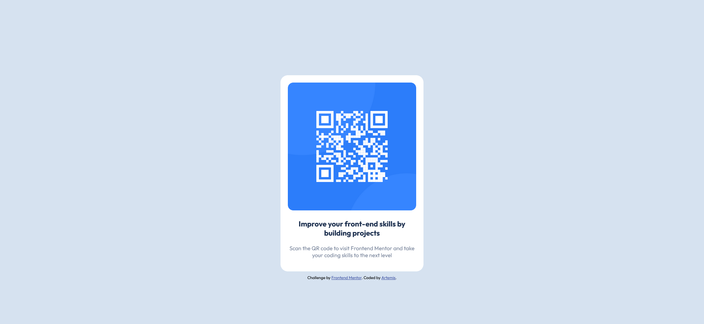

# Frontend Mentor - QR code component solution

This is a solution to the [QR code component challenge on Frontend Mentor](https://www.frontendmentor.io/challenges/qr-code-component-iux_sIO_H). Frontend Mentor challenges help you improve your coding skills by building realistic projects. 

## Table of contents

- [Overview](#overview)
  - [Screenshot](#screenshot)
  - [Links](#links)
- [My process](#my-process)
  - [Built with](#built-with)
  - [Continued development](#continued-development)
- [Author](#author)

**Note: Delete this note and update the table of contents based on what sections you keep.**

## Overview

### Screenshot

### Links

- Solution URL: (https://github.com/Artemis-Orion/qr-code-project)
- Live Site URL: (https://artemis-orion-s-qr-code-page.netlify.app/)

## My process

I used Visual Studio Code to edit the files and used a live preview of my build to check my work.

### Built with

- HTML5 markup
- Flexbox

### Continued development

Going forward, my goal is to gain a better understanding of flexbox and grid, as well as a firmer grasp on CSS as a whole.

## Author

- Website - [Artemis Orion](https://tourmaline-pika-a5a537.netlify.app/)
- Frontend Mentor - [@Artemis-Orion](https://www.frontendmentor.io/profile/Artemis-Orion)

**Note: Delete this note and add/remove/edit lines above based on what links you'd like to share.**